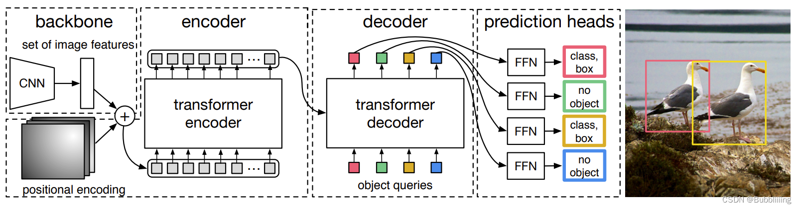

# 网络结构解析

detr分为四个部分backbone, encoder, decoder, prediction heads

* backbone 负责主干特征的提取, 输入的图片首先在主干网络中进行特征提取。提取的可以成为特征层
，是输出图片的特征集合。
* encoder是Transformer的编码特征-特征加强, 在主干部获得的有效特征会首先在高纬度
进行平铺，成为一个特征序列，然后再使用self-attentionj加强特征提取。
* decoder，对encoder部分获得的有效特征进行解码，解码需要使用到科学系的模块
即object query, 在decoder部分，我们使用可学习的查询向量q对加强后的有效特征进行查询
获得结果。
* prediction head是detr的分类器和回归器，其实就是对decoder输出的预测结果进行全连接
分别有2个FFN 分别输出object class，box
* 整个流程可以总结为：特征提取，特征加强，特征查询-预测结果